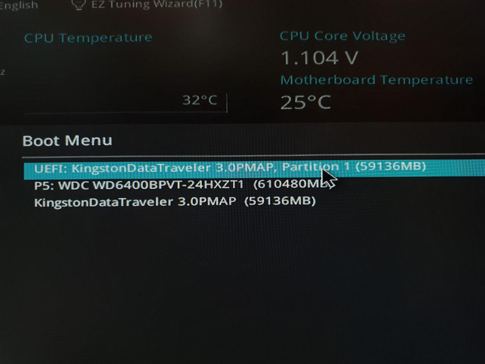
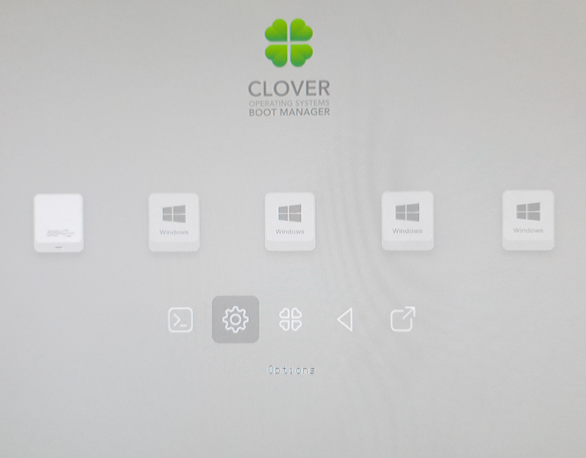
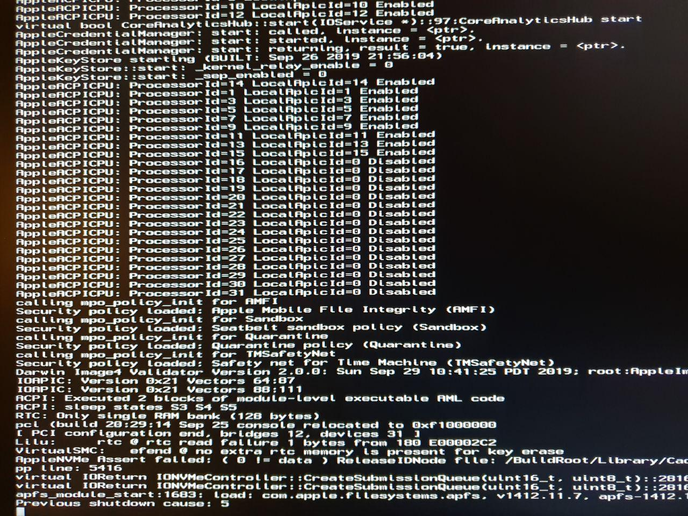
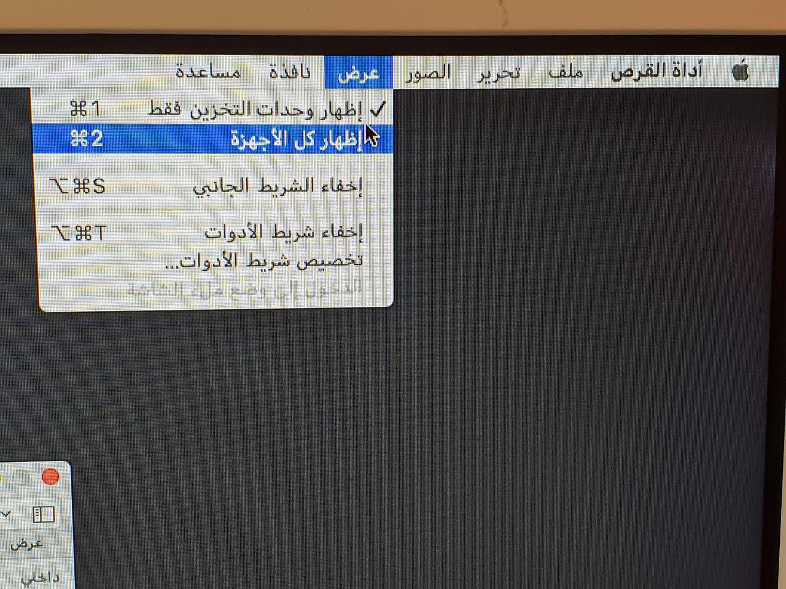
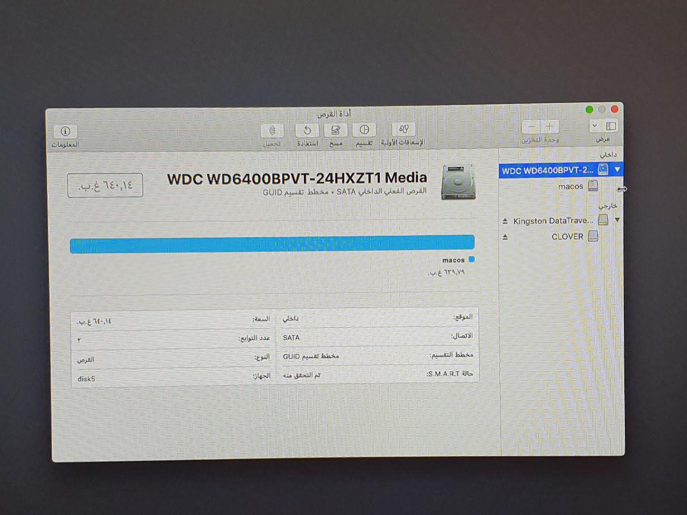
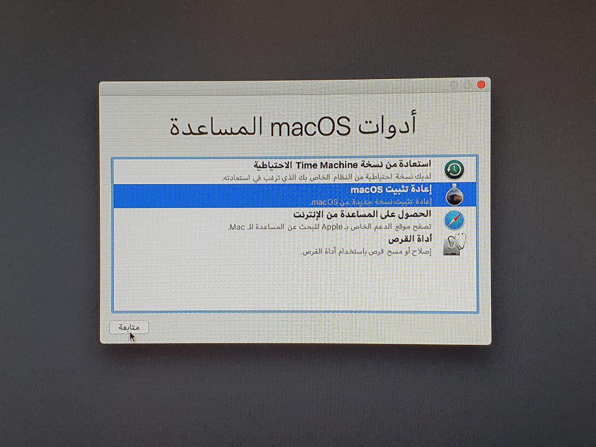
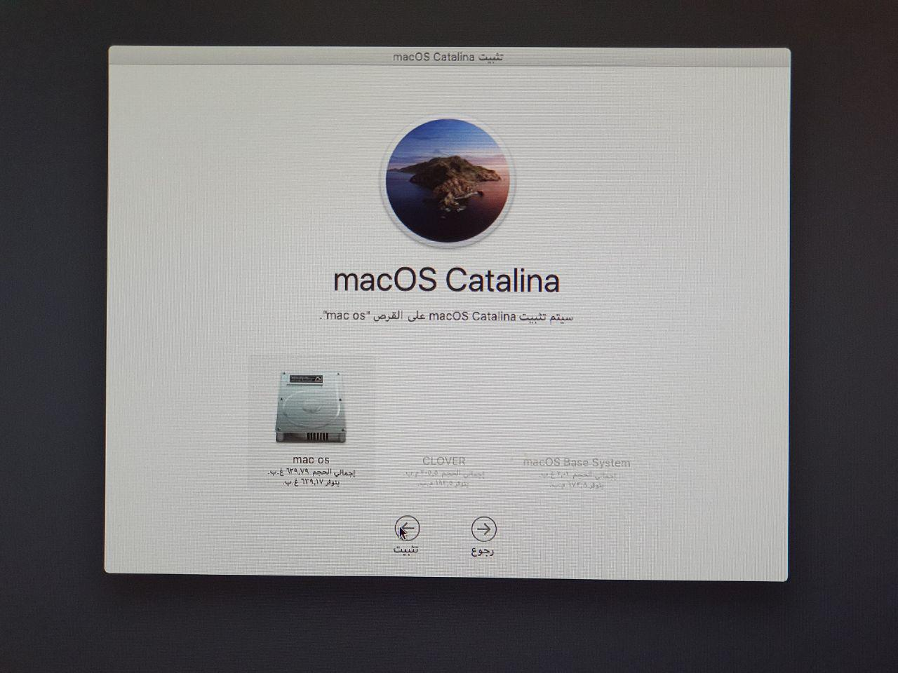
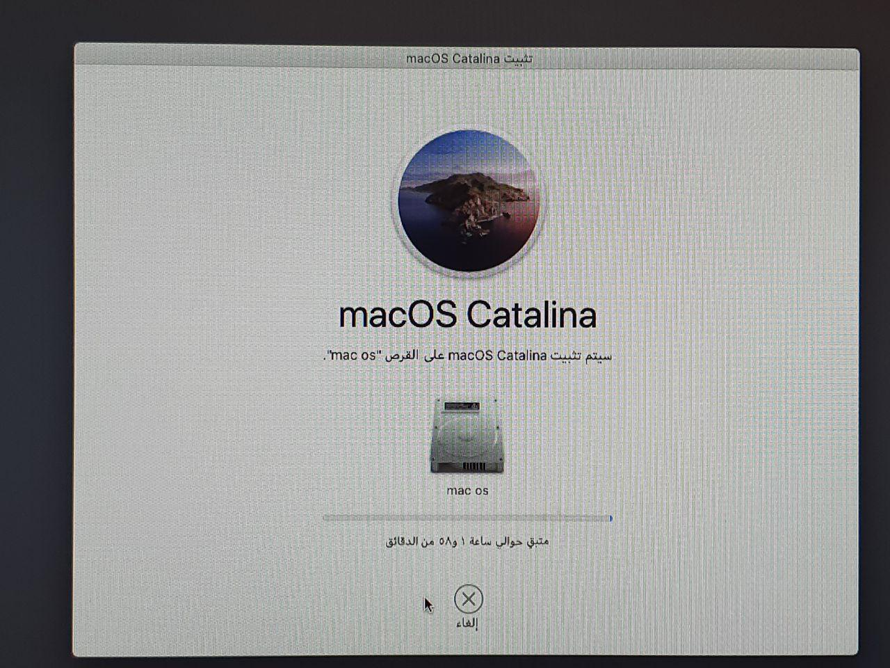

# الاقلاع


الكيبورد و التتش باد في الابتوبات لا يعمل في تثبيت الماك راح تحتاج إلى ماوس وكيبورد منفصلان بعد التثبيت راح تبدء عمليه البحث عن التعريفات


اول شي لازم تعرف ان إذا كنت تخطط لنزيل **الماك و الويندوز** يجب ان **تنزل الماك أولا ثم تنزل الويندوز** يعني إذا كان عندك ويندوز من قبل على الجهاز يجب تفرمته إذا كان على نفس الهارد دسك

الان أول شيء هو خيارات البايوس ليش من الضروري ان تتوفر جميع الخيارات عندك ابحث وعدل الخيارات الموجوده

* VT-Dأوقفه للضمان فقط
* cfg-lockأوقف
* secure bootأوقف
* other OS غير نوع النظام إلى 
* XHCI Hand off فعل 
* Serial portأوقف

الان يجب انت تقلع من ال usb طريقه اختيار ال usb للاقلاع تخلتف على حسب المذربورد/الجهاز لاكن معظم الاجهزه تستخدم F8,F11أو Del

ثم اختار قسم ال UEFI من ال usb

بعد اقلاع الكلوفر نختار options \(علامه الاعدادات\)

وتاكد من وجود -V في Bootargs إذا لم يكن -V موجود كل الي عليك الكتابة في bootargs اترك مسافه عن الكلمة التي قبله واكتب "v-" ثم اضغط انتر لان v- يضع النظام بحاله الصيانة ويظهر مشكله الإقلاع بالظبط.

ثم اخرج من الاعدادات واختار Boot mac OS

اذا توقفت الشاشه عن التحرك لمده 5 دقائق صور اخر سطر من المكتوب وارسله لموقع هاكنتوش بالعربي الرسمي  
او مواقع الشات المباشره مثلا[ السيرفر الرسمي لهاكنتوش بالعربي في دسكورد](https://discord.gg/mNMtceb)  
والمشرفين في الموقع راح يحاولو مساعدتك أو مشرفين الشات

الان اختار لغه التثبيت العربيه  
ثم بعدها اذهب إلى اداره الاقراص _**الان سوف نفرمت وحده التخزين تاكد من نسخ بياناتك!!!**_

بعدها نضغط على عرض ثم نختار اظهار كل الاجهزه

ثم تحت الداخلي سوف تجد وحدات التخزين المتوفره داخل الجهاز اختار وحده التخزين التي سوف تنزل عليها الماك ثم اختار مسح

بعدها يمكنك ان تضع اسم لوحده التخزين مثلا MAC os إذا كان وحده التخزين لديك هاردسك عادي تاكد من استخدام تخطيط  
**\*\*** Mac OS Extended \(journaled\*\*\)

اذا كانت وحده التخزين من نوع ssd سواء SATA أو NVME اختار تخطيط APFS

ثم اختار مسح  
بعد اتمام عمليه المسح نخرج من اداره الاقراص ونذهب إلى اعاده تثبيت MacOS

نكمل مع الموافقة على الشروط

ثم بعدها اختار وحده التخزين الذي سيثبت عليها الماك

الان سيقوم الماك بالتثبيت تختلفالسرعة على حسب سرعه وحده التخزين وسرعه ال usb واذا كنت تستخدم طريقه التثبيت مع الانترنت تعتمد ايضا على سرعه الانترنت

اثناء التثبيت سوف يعيد التشغيل الماك نفسه عده مرات اختار

**Boot macOS from \(اسم وحده التخزين\)**

مثلا : Boot macOS from **macos** اسم وحده التخزين هنا : **macos  
بعد مرتين من اعاده التشغيل الجهاز سوف يظهر معك شاشه ترحيب الماك اكمل الخطوات حتى تصل إلى سطح المكتب**

