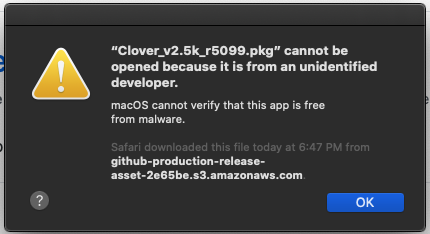
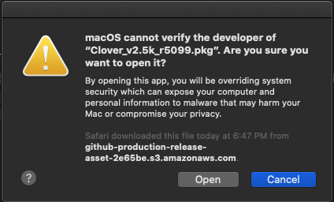
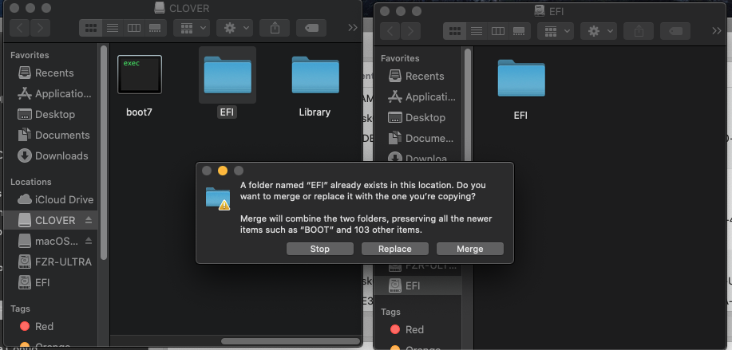

# بعد التثبيت

## مبروووووووووووووووووووك!!!!!

الله ظبط معك الهاكنتوش, جميل الان بعض الخطوات البسيطه وتقدر تقول انك دخلت عالم الهاكنتوش

سوف نحتاج الى برنامجين بعد تشغيل الماك اول مره 

نحتاج ان نثبت الكلوفر على وحده التخزين لان كما لاحظت ال usb هو الذي يسمح للجهاز بالاقلاع وبدونه لايمكن اقلاع الى النظام تنزيل الكلوفر من [هنا](https://github.com/CloverHackyColor/CloverBootloader/releases)


قم بتنزيل ملف .pkg فهي صيغه البرامج في الماك شبيهه ب .exe في الويندوز


وسوف نحتاج برنامج [clover configurator](https://mackie100projects.altervista.org/download-clover-configurator/) بحيث هو الذي سيسمح لنا بالدخول الى قسم ال efi ونقل التعريفات والملفات الضروريه من usb الى وحده التخزين

## تثبيت clover

الان نبدا مع تثبيت الكلوفر بعد تنزيل البرنامج وفتحه سوف يظهر لنا تعذر فتح البرنامج لانه من مطور غير موثق

الان نذهب الى الاعدادات \(ايقونتها تشبه اعدادات الايفون\) وثم نختار security &privacy او بالعربي تكون الامن والخصوصيه

ثم بعدها نقوم باختيار open anyway او الفتح على كل حال

نختار نعم لتاكيد فتح البرنامج

نختار continue 

عندما تصل installiton type تاكد من اسم وحده التخزين يطابق بما سميتها اثناء تثبيت الماك في هاذه الحاله macos

واكمل التثبيت

## برنامج clover configurator \(cc\)

الان نبدا مع برنامج cc 

طبعا اول مره نفتحه نواجهه مشكله المطور الغير موثوق ونتبع نفس الخطوات بالسماح له من الاعدادات

ثم عندم يفتح البرنامج نختار mount efi ثم بعدها ابحث عن وحده التخزين الخاصه بك **وتاكد من اسمها** ثم بعدها ثم اضغط على mount pratition

ثم بعدها نختار open partition  

وبعدها نقوم بنسخ ملف efi من قسم clover من الusb الى قسم ال efi من وحده التخزين الخاصه بك بحيث نقوم بنقل نفس التعريفات وجميع الاعدادات

بعد ما تعيد اقلاع الجهاز وتقلع من وحده التخزين تاكد ان كل شيء يعمل صوت,واي فاي,بلوتوث,الخ واذا كان هناك شيء لا يعمل اذهب الى علامه ابل في الزاويه ثم حول هاذا الماك ثم الى system report وتاكد من ان القطعه غير موجوده اذا لم تكون فعلا موجوده تبدا رحلتك في بحث عن تعريفات سواء من موقع هاكنتوش بالعربي او على الانترنت بشكل عام بعد التثبيت

## نصائح عامه في الهاكنتوش

* **لاتقوم بالتحديث مباشره ابدا** تاكد من تحديث الكلوفر وتحديث الكيكستات واذا كان تحديث كبير تاكد من انه مدعوم والافضل ان تنتظر مده
* انتبه من التلاعب في ملف efi من اضافه تعاريف او تعديل الكونفق بدون تثبيت الكلوفر على usb خارجي حيث يمكنك الدخول على النظام عبر usb اذا لم يقلع معك الجهاز
* يجب ان تبقي نفسك متابع لعالم الهاكنتوش مثلا عبر موقعنا حيث قد تحدث تغيرات كبيره وتحتاج الى تعديل اشياء في النظام

### اذا نجحت في تثبيت الماك اذهب الى [منتدى هاكنتوش بالعربي ](https://هاكنتوش.com/)ثم الى قسم الاصدار الذي ثبتته واكتب في العنوان \(تم التثبيت\) ثم مواصفات جهازك  ثم اكتب المشاكل التي واجهتك ويفضل رفع ملف ال efi الخاص فيك لمساعده الاعضاء وشكرا لكم

