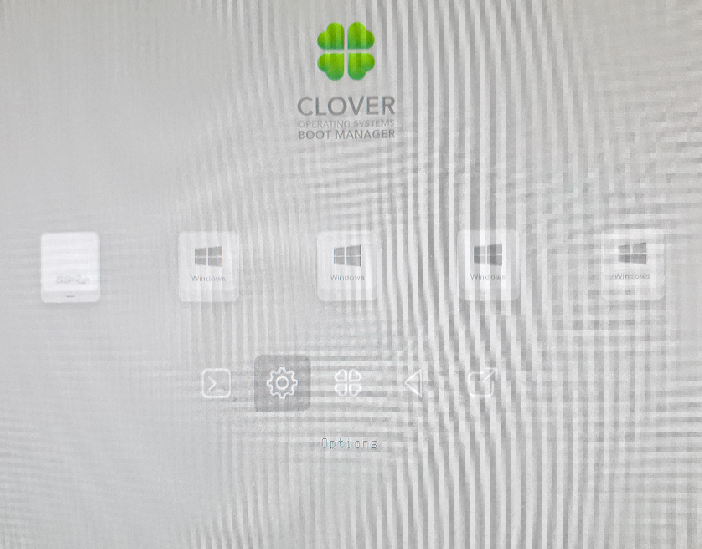

# الاقلاع


الكيبورد و التتش باد في الابتوبات لا يعمل في تثبيت الماك راح تحتاج الى ماوس وكيبورد منفصلان بعد التثبيت راح تبدء عمليه البحث عن التعريفات


اول شي لازم تعرف ان اذا كنت تخطط لنزيل **الماك و الويندوز** يجب ان **تنزل الماك اولا ثم تنزل الويندوز** يعني اذا كان عندك ويندوز من قبل على الجهاز يجب تفرمته اذا كان على نفس الهارد دسك 

الان اول شيء هو خيارات البايوس ليش من الضروري ان تتوفر جميع الخيارات عندك ابحث وعدل الخيارات الموجوده

* VT-D اوقفه للضمان فقط
* cfg-lock اوقف
* secure boot اوقف
* other OS غير نوع النظام الى 
* XHCI Hand off فعل 
* Serial port اوقف

الان يجب انت تقلع من ال usb طريقه اختيار ال usb للاقلاع تخلتف على حسب المذربورد/الجهاز لاكن معظم الاجهزه تستخدم F8,F11 او Del

بعد اقلاع الكلوفر نختار options \(علامه الاعدادات\)

وتاكد من وجود -V في Bootargs اذا لم يكن -V موجود كل الي عليك الكتابه في bootargs اترك مسافه عن الكلمه التي قبله واكتب "v-" ثم اضغط انتر 

واخرج من الاعدادات واختار Boot mac OS

اذا توقفت الشاشه عن التحرك لمده 5 دقائق صور اخر سطر من المكتوب وارسله لموقع هاكنتوش العرب الرسمي او قنوات المساعده المباشره   
 والمشرفين في الموقع راح يحاولو مساعدتك او مشرفين القنوات المباشره  
  
اذا نجح الاقلاع كل الي عليك هو اكمال خطوات تثبيت الماك بالنسبه لوضع حساب الماك هو **اختياري**

