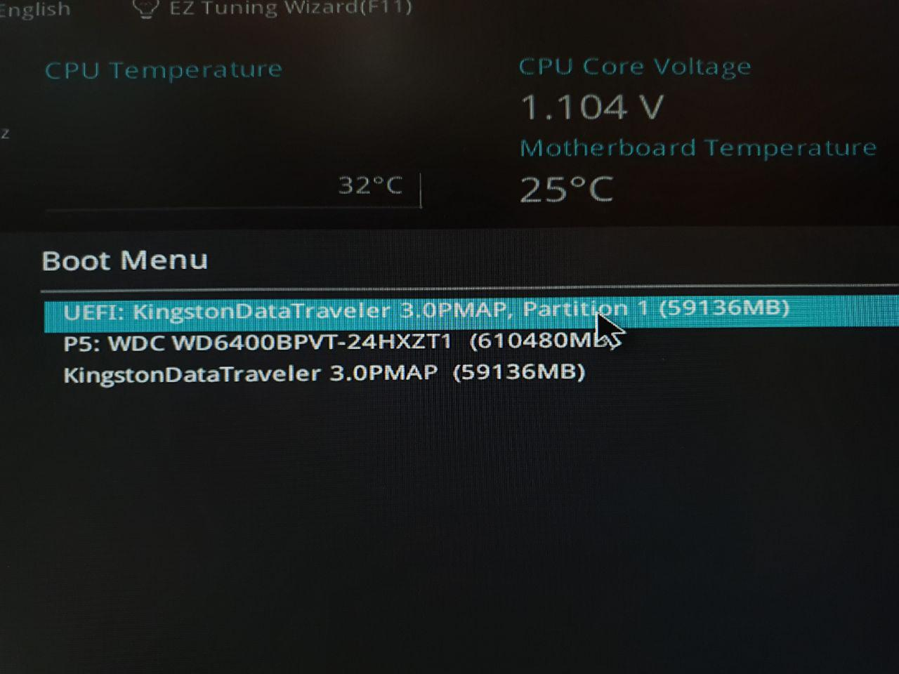
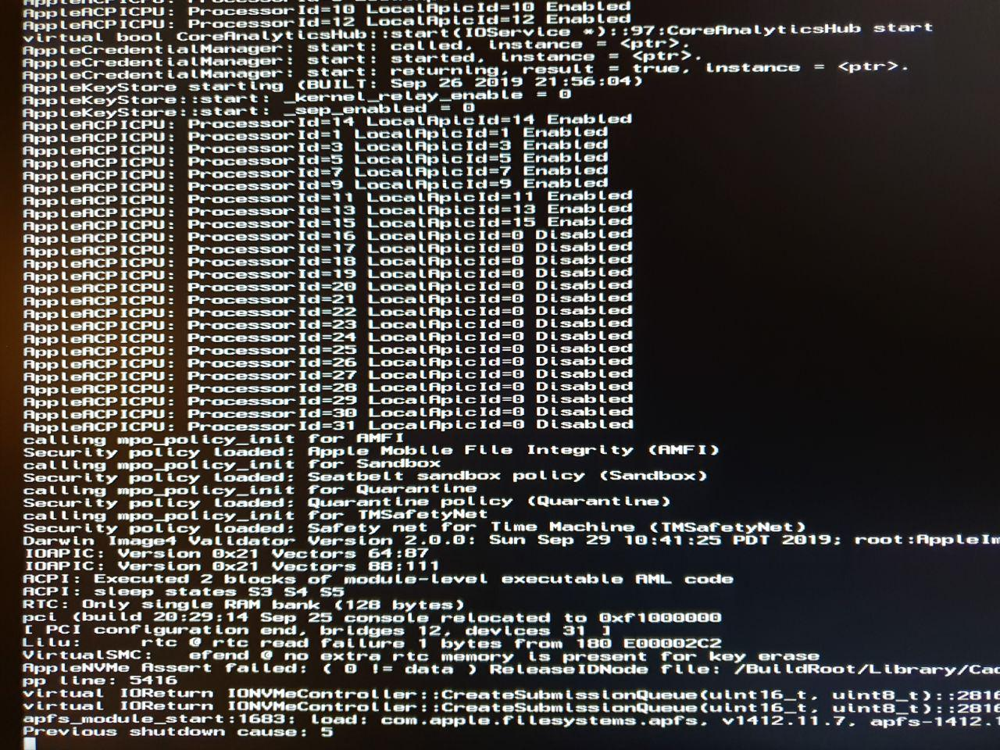
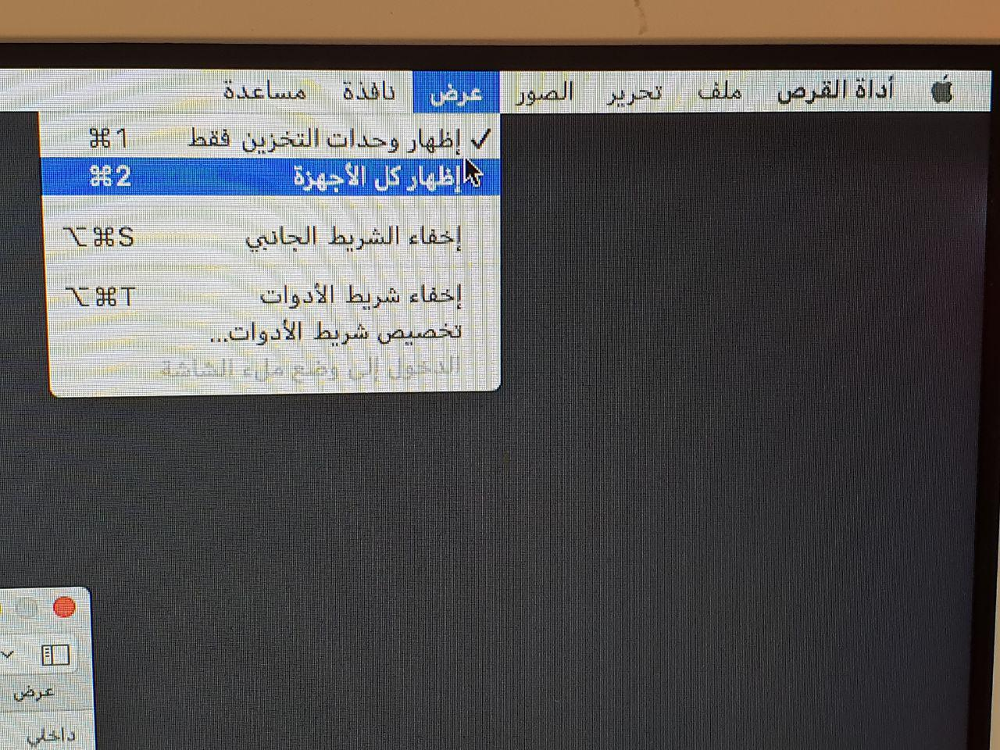
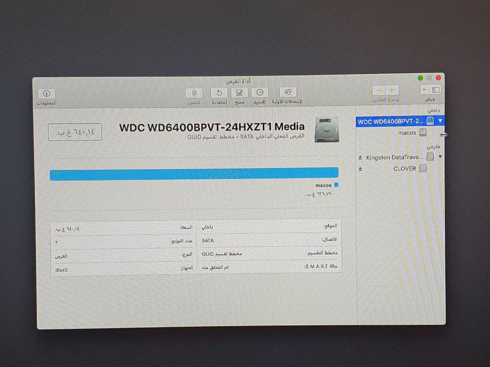
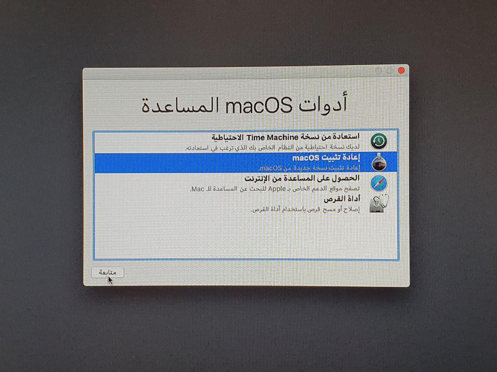
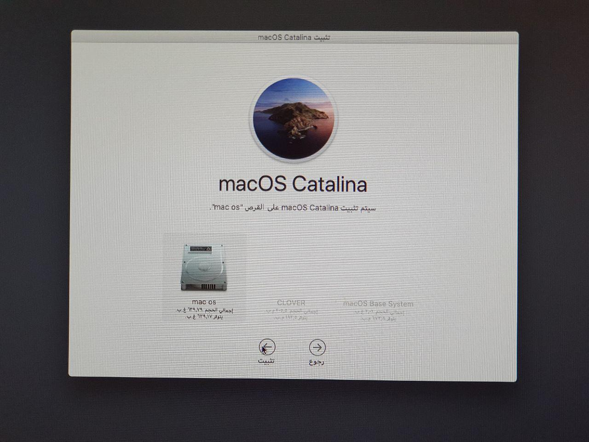
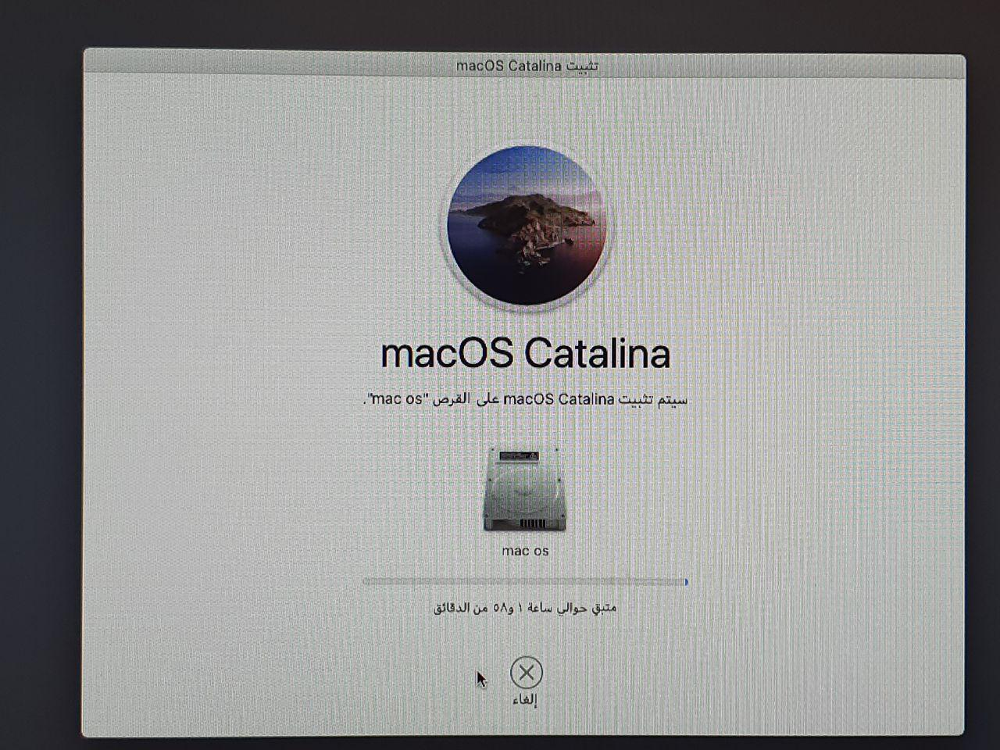

# الاقلاع


الكيبورد و التتش باد في الابتوبات لا يعمل في تثبيت الماك راح تحتاج الى ماوس وكيبورد منفصلان بعد التثبيت راح تبدء عمليه البحث عن التعريفات


اول شي لازم تعرف ان اذا كنت تخطط لنزيل **الماك و الويندوز** يجب ان **تنزل الماك اولا ثم تنزل الويندوز** يعني اذا كان عندك ويندوز من قبل على الجهاز يجب تفرمته اذا كان على نفس الهارد دسك

الان اول شيء هو خيارات البايوس ليش من الضروري ان تتوفر جميع الخيارات عندك ابحث وعدل الخيارات الموجوده

* VT-D اوقفه للضمان فقط
* cfg-lock اوقف
* secure boot اوقف
* other OS غير نوع النظام الى 
* XHCI Hand off فعل 
* Serial port اوقف

الان يجب انت تقلع من ال usb طريقه اختيار ال usb للاقلاع تخلتف على حسب المذربورد/الجهاز لاكن معظم الاجهزه تستخدم F8,F11 او Del

ثم اختار قسم ال UEFI من ال usb

بعد اقلاع الكلوفر نختار options \(علامه الاعدادات\)

وتاكد من وجود -V في Bootargs اذا لم يكن -V موجود كل الي عليك الكتابه في bootargs اترك مسافه عن الكلمه التي قبله واكتب "v-" ثم اضغط انتر لان v- يضع النظام بحاله الصيانه ويظهر مشكله الاقلاع بالظبط.

ثم اخرج من الاعدادات واختار Boot mac OS

اذا توقفت الشاشه عن التحرك لمده 5 دقائق صور اخر سطر من المكتوب وارسله لموقع هاكنتوش العرب الرسمي او قنوات المساعده المباشره  
والمشرفين في الموقع راح يحاولو مساعدتك او مشرفين القنوات المباشره

الان اختار لغه التثبيت العربيه  
ثم بعدها اذهب الى اداره الاقراص     _**الان سوف نفرمت وحده التخزين تاكد من نسخ بياناتك!!!**_

بعدها نضغط على عرض ثم نختار اظهار كل الاجهزه

ثم تحت الداخلي سوف تجد وحدات التخزين المتوفره داخل الجهاز اختار وحده التخزين التي سوف تنزل عليها الماك ثم اختار مسح

بعدها يمكنك ان تضع اسم لوحده التخزين مثلا  MAC os اذا كان وحده التخزين لديك هاردسك عادي تاكد من استخدام تخطيط  
**** **Mac OS Extended \(journaled**\)

اذا كانت وحده التخزين من نوع ssd سواء SATA  او NVME اختار تخطيط APFS

ثم اختار مسح  
بعد اتمام عمليه المسح نخرج من اداره الاقراص ونذهب الى اعاده تثبيت MacOS

نكمل مع الموافقه على الشروط

ثم بعدها اختار وحده التخزين الذي سيثبت عليها الماك

الان سيقوم الماك بالتثبيت تختلف السرعه على حسب سرعه وحده التخزين وسرعه ال usb

