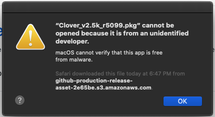
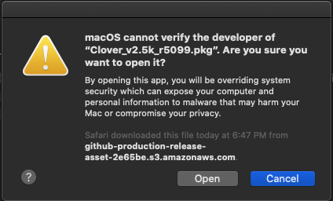
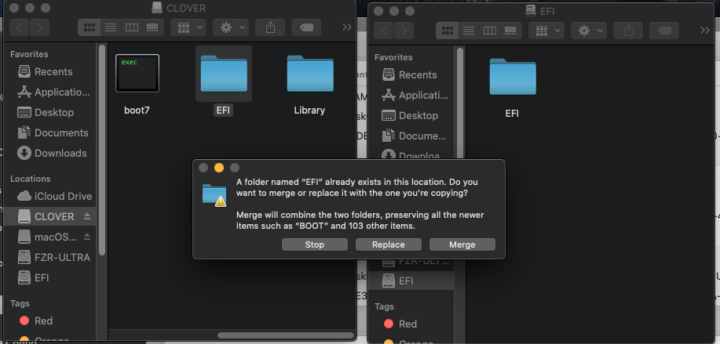

# بعد التثبيت

هنا اهم الخطوات بعد تثبيت الماك, طبعا هناك خطوات اضافيه مثل تصليح خدمات ابل و تصليح السليب لكن هنا الخطوات الاساسية فقط.

???+ tip "ملحوظة"
	اذا كان معك كرت **انفيديا** [ هنا شرح تثبيت التعريف](https://forum.xn--mgbg4a8cpdl.com/threads/kif-tthbt-tyrifat-anfidia-yl-xai-siira.27)

## نسخ الاوبن كور من ال USB

هذه الخطوه ضروريه حتى يمكنك الاقلاع بدون الحاجه الى USB خارجي (يستحسن دائما ابقاء نسخه احتياطيه من ملف ال EFI على usb في حاله حدوث اي مشكله في الاقلاع من الهاردسك)

سنستخدم سكربت [MountEFI](https://github.com/corpnewt/MountEFI)(تنزله بستخدام زر code) لاظهار اقسام ال EFI في ال usb والهاردسك الداخلي.

لتشغيل السكربت قم بفتح تيرمنال داخل ملف السكربت ثم اكتب:

```
chmod +x MountEFI.command

./MountEFI.command
```
اولا نختار اظهار ال USB
مثلا `install macOS Catalina`


تاكد من نسخ ملف ال **EFI** كامل لصطح المكتب, ثم بعد ذلك قم بعمل اخراج لقسم ال EFI.

نرجع للسكربت ثم هذه المره نقوم بختيرا الهاردسك الداخلي بدلا عن الUSB.

بعد اظهار قسم ال EFI الخاص بالهاردسك الداخلي, قد تلاحظ وجود ملف APPLE وهو مخصص لتحديث تعريفات الفريم وير.

قم بحذف ملف الEFI الموجود سابقا واستبدله بالخاص بالاوبن كور.

## تثبيت clover

الان نبدا مع تثبيت الكلوفر بعد تنزيل البرنامج وفتحه سوف يظهر لنا تعذر فتح البرنامج لانه من مطور غير موثق



الان نذهب الى الاعدادات \(ايقونتها تشبه اعدادات الايفون\) وثم نختار security &privacy او بالعربي تكون الامن والخصوصيه


ثم بعدها نقوم باختيار open anyway او الفتح على كل حال


نختار نعم لتاكيد فتح البرنامج



نختار continue


عندما تصل installiton type تاكد من اسم وحده التخزين يطابق بما سميتها اثناء تثبيت الماك في هاذه الحاله macos


واكمل التثبيت

## برنامج clover configurator \(cc\)

الان نبدا مع برنامج cc

طبعا اول مره نفتحه نواجهه مشكله المطور الغير موثوق ونتبع نفس الخطوات بالسماح له من الاعدادات

ثم عندم يفتح البرنامج نختار mount efi ثم بعدها ابحث عن وحده التخزين الخاصه بك **وتاكد من اسمها** ثم بعدها ثم اضغط على mount pratition


ثم بعدها نختار open partition

وبعدها نقوم بنسخ ملف efi من قسم clover من الusb الى قسم ال efi من وحده التخزين الخاصه بك بحيث نقوم بنقل نفس التعريفات وجميع الاعدادات



بعد ما تعيد اقلاع الجهاز وتقلع من وحده التخزين تاكد ان كل شيء يعمل صوت,واي فاي,بلوتوث,الخ واذا كان هناك شيء لا يعمل اذهب الى علامه ابل في الزاويه ثم حول هاذا الماك ثم الى system report وتاكد من ان القطعه غير موجوده اذا لم تكون فعلا موجوده تبدا رحلتك في بحث عن تعريفات سواء من موقع هاكنتوش بالعربي او على الانترنت بشكل عام بعد التثبيت

## نصائح عامه في الهاكنتوش

* **لاتقوم بالتحديث مباشره ابدا** تاكد من تحديث الكلوفر وتحديث الكيكستات واذا كان تحديث كبير تاكد من انه مدعوم والافضل ان تنتظر مده
* انتبه من التلاعب في ملف efi من اضافه تعاريف او تعديل الكونفق بدون تثبيت الكلوفر على usb خارجي حيث يمكنك الدخول على النظام عبر usb اذا لم يقلع معك الجهاز
* يجب ان تبقي نفسك متابع لعالم الهاكنتوش مثلا عبر موقعنا حيث قد تحدث تغيرات كبيره وتحتاج الى تعديل اشياء في النظام

### اذا نجحت في تثبيت الماك اذهب الى [مجتمع هاكنتوش بالعربي ](https://هاكنتوش.com/)ثم الى تم التثبيت واكتب في العنوان مواصفات جهازك مع الاصدار الذي ثبتته  ثم اكتب المشاكل التي واجهتك ويفضل رفع ملف ال efi الخاص فيك لمساعده الاعضاء وشكرا لك

