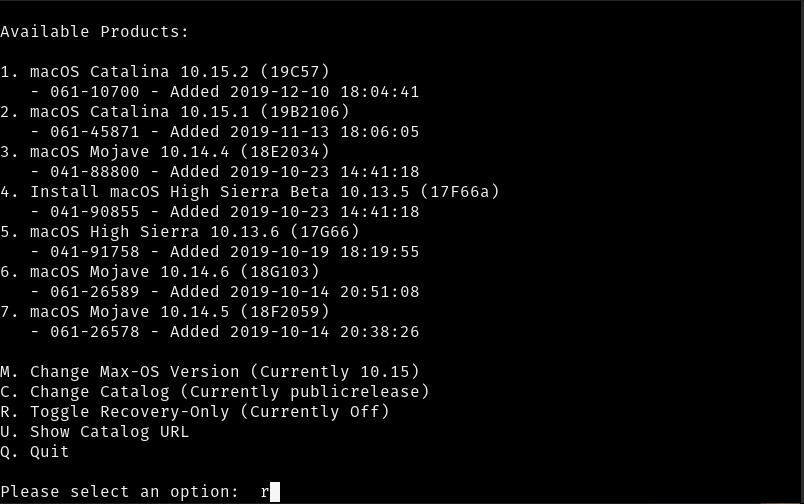
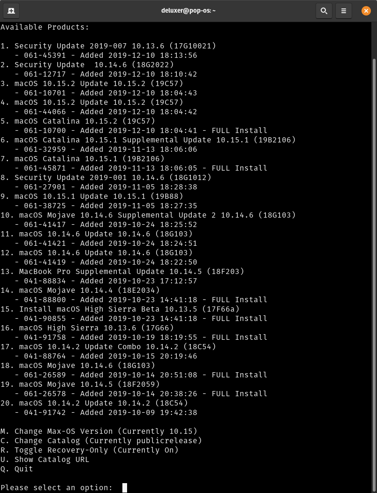
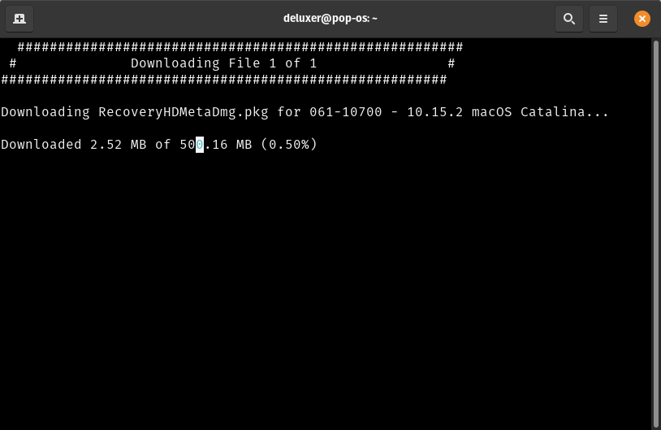
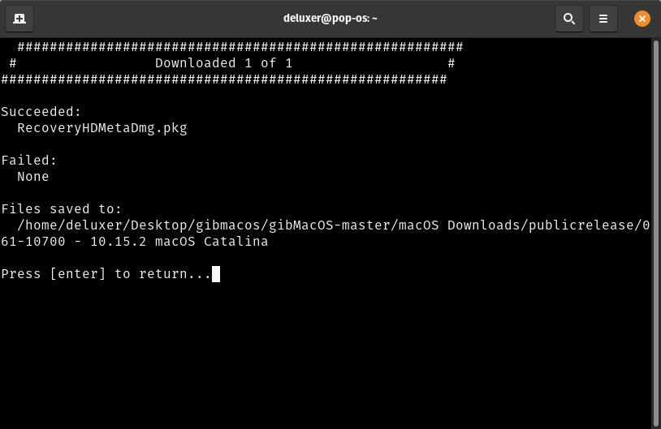
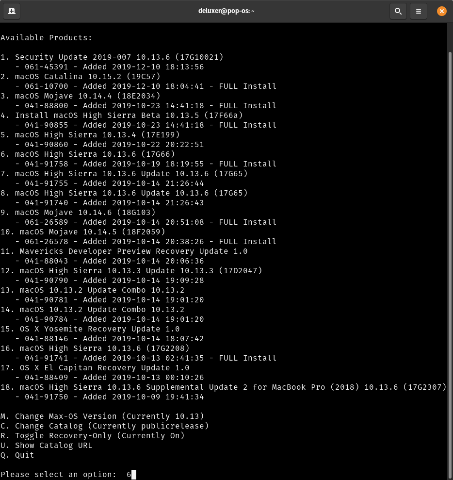

# تنزيل الماك

بما انك اخترت التثبيت مع الانترنت سوف نقوم بتنزيل نسخه الريكوفري وليست النسخة الكامله لان النسخة الكامله سوف يتم تنزيلها اثناء التثبيت

بعد تحميلك اداه تنزيل الماك[ gibmacos](https://github.com/corpnewt/gibMacOS) عنطريق الضغط على زر clone or download وثم اختار Download ZIP

بعد ما يتم التحميل نفك الضغط و بعدها نفتح الملف ونختار gibMacOS.bat

في حاله عدم وجود بايثون 3 على حهازك البرنامج سيطلب منك تحميله اكتب y للموافقه

بعدها نقوم باختيار r للحصول على نسخ الريكوفري

البرنامج يرتب النسخ **بحسب وقت اصدارها** ابل ايضا تحدث الاصدارات القديمه نحن نريد اصدار 10.15 كاتلينا وهو اخر اصدار من الماك ويجب ان يكون مكتوب تحته FULL install اخر اصدار يتوفر منه FULL install هو خيار رقم 5 في تاريخ كتابه الشرح الترتيب يختلف على حسب الوقت

ثم سيقوم البرنامج ببدء التنزيل


سرعه التنزيل تعتمد على سرعه الانترنت الخاص بك


سوف تظهر قائمه الملفات التي تم تنزيلها بنجاح واذا لم يوجد اي ملف تحت failed مبروك لقد تم تنزيل النسخة بنجاح تحت File saved to  
يوجد موقع حفظ الملف سوف نحتاجه في الخطوة القادمه

## تحميل نسخ اقدم

اذا كنت تحتاج نسخ اقدم مثل لو كان لديك كرت انفيديا بعد اختيار R لتفعيل وضع الريكوفري اضغط M في الصفحه الرئيسيه ثم اكتب رقم النسخة بهذه الحالة سوف تكون 10.13

سيقوم البرنامج بتحميل قائمه الاصدارات المتوفره

سوف تظهر اختيارات جديده نختار اعلى اختيار من الاصدار المطلوب بهاذه الحالة MacOS High Sierra

ثم سيقوم البرنامج بتنزيل الملف الاساسي فقط

